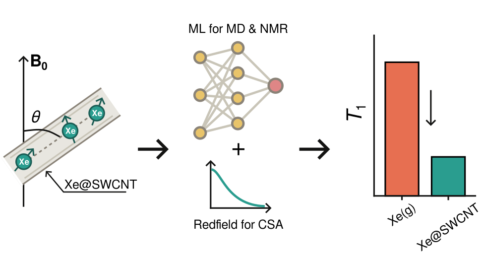

# Supporting Code for "*Machine Learning-Powered Simulations of Confinement-Driven <sup>129</sup>Xe Nuclear Spin Relaxation*"

## Graphical Abstract



---

📄 Author: **Ouail Zakary** 
- 📧 Email: [Ouail.Zakary@oulu.fi](mailto:Ouail.Zakary@oulu.fi)  
- 🔗 ORCID: [0000-0002-7793-3306](https://orcid.org/0000-0002-7793-3306)  
- 🌐 Website: [cc.oulu.fi/~nmrwww/members/Ouail_Zakary.html](https://cc.oulu.fi/~nmrwww/members/Ouail_Zakary.html)  
- 📁 Personal Website: [ozakary.github.io](https://ozakary.github.io/)

---

This is the Supporting Code for the manuscript "*Machine Learning-Powered Simulations of Confinement-Driven <sup>129</sup>Xe Nuclear Spin Relaxation*". [DOI: TBA]

This work builds on the MLMD trajectories and NMR-ML predicted <sup>129</sup>Xe magnetic shielding tensors from our previous study (see [data-Xe_at_CNTs](https://github.com/ozakary/data-Xe_at_CNTs)). The repository comprises the following sections:

1. Outlier correction and time correlation function (TCF) construction. ([directory](./preprocessing_and_tcf/))
2. Powder-averaged relaxation times at a general SWCNT-to-B<sub>0</sub> tilt angle, the primary methodology. ([directory](./powder_averaged_relaxation/))
3. θ=0 (SWCNT axis parallel to B<sub>0</sub>) reference relaxation calculation. ([directory](./theta0_reference_relaxation/))
4. Per-atom uncertainty estimation for the powder-averaged relaxation times. ([directory](./uncertainty_estimation/))
5. Fit-window and angle-grid convergence validation. ([directory](./validation_cutoff_and_angle_grid/))
6. Batch orchestration and results collection across all 38 systems. ([directory](./run_orchestration_and_results/))
7. Symbolic verification of the reduced Wigner rotation matrix. ([directory](./wigner_matrix_verification/))
8. Manuscript and SI figure generation. ([directory](./figures/))
9. Manuscript and SI table generation. ([directory](./tables/))

## Citations
If you use the code in this repository, please cite the following:

### Paper  

```bibtex
@article{zakary_xe-relax-at-cnts_paper_2026,
  title={Machine Learning-Powered Simulations of Confinement-Driven $^{\text{129}}$Xe Nuclear Spin Relaxation},
  author={Zakary, Ouail and Jacklin, Tiia and Lantto, Perttu},
  journal={ChemRxiv},
  volume={},
  pages={}, 
  year={2026},
  publisher={TBA},
  doi={TBA},
  url={TBA}
}
```

### Dataset  

```bibtex
@dataset{zakary_xe-relax-at-cnts_data_2026,
  author = {Zakary, Ouail and Jacklin, Tiia and Lantto, Perttu},
  title = {Supporting Data for "Machine Learning-Powered Simulations of Confinement-Driven $^{\text{129}}$Xe Nuclear Spin Relaxation"},
  year = {2026},
  publisher = {Zenodo},
  doi = {TBA},
  url = {TBA}
}
```

### Code [](https://github.com/ozakary/data-Xe_at_CNTs_relax)
```bibtex
@misc{zakary_xe-relax-at-cnts_code_2026,
  author = {Zakary, Ouail and Jacklin, Tiia and Lantto, Perttu},
  title = {Supporting Code for "Machine Learning-Powered Simulations of Confinement-Driven $^{\text{129}}$Xe Nuclear Spin Relaxation"},
  year = {2026},
  publisher = {GitHub},
  journal = {GitHub repository},
  howpublished = {\url{https://github.com/ozakary/data-Xe_at_CNTs_relax}},
  url = {https://github.com/ozakary/data-Xe_at_CNTs_relax}
}
```

---
For further details, please refer to the respective folders or contact the author via the provided email.
